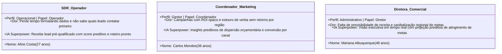
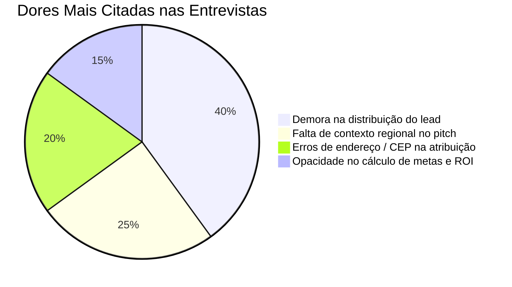
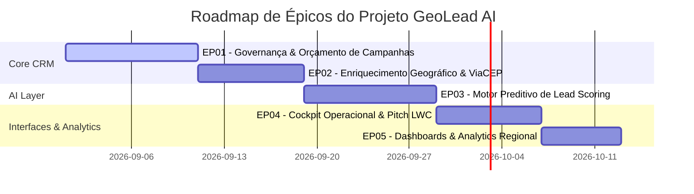
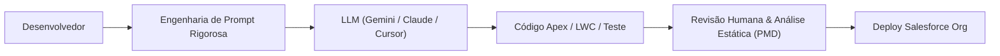
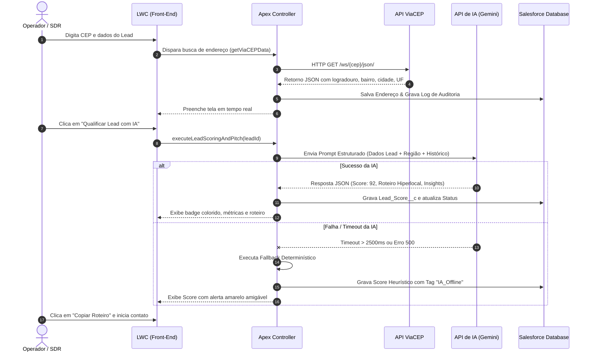
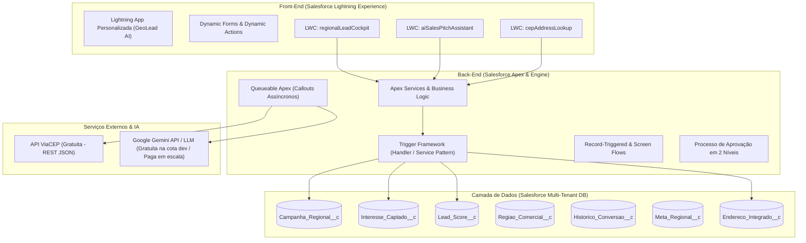

# Entrega Parcial RiseUp | Residência em Software & IA
**Parceria:** Porto Digital & Capgemini  
**Tema do Projeto:** Gestão de Campanhas e Leads Regionais  
**Nome da Solução Comercial:** **GeoLead AI** (Plataforma Inteligente de Gestão de Campanhas e Distribuição Geográfica de Leads)  
**Versão do Documento:** 1.0 (Entrega Parcial - 10,0 Pontos)

---

## Sumário Executivo & Construção da Marca

### 🏷️ Identidade da Marca e Solução de Mercado
- **Nome Comercial:** **GeoLead AI**
- **Slogan:** *Conectando dados geográficos e inteligência preditiva para maximizar a conversão regional.*
- **Proposta de Valor:** Transformar o ciclo de vida do lead regional corporativo combinando a robustez do ecossistema Salesforce (CRM, automação via Flows, Apex assíncrono e validação geográfica ViaCEP) com o poder da Inteligência Artificial preditiva e generativa para qualificação em tempo real (*AI Lead Scoring*) e geração de abordagens hiperlocalizadas.
- **Logomarca e Identidade Visual:**
  - *Símbolo:* Marcador de geolocalização (*pin*) estilizado em gradiente azul cobalto (#0070D2) e ciano elétrico (#0176D3), cujas linhas se fundem a uma rede neural e um nó de convergência de dados.
  - *Tipografia:* Salesforce Sans e Inter, transmitindo clareza, modernidade e precisão empresarial.
  - *Cores Institucionais:* Azul Salesforce (#0176D3), Azul Capgemini (#0070AD), Verde Conversão (#2E844A) e Roxo IA (#9050E9).

---

## 1. Definição do Problema e Personas "IA-Augmented" (2,0 Pontos)

### 1.1. Descrição do Problema, Solução e Oportunidade de IA

#### ● Problema (máximo 250 caracteres)
> *"Empresas perdem até 40% das conversões por lentidão no enriquecimento e distribuição manual de leads regionais, gerando disparidade entre metas territoriais e atendimento descontextualizado da realidade sociocultural de cada praça comercial."*  
> **(Contagem exata: 247 caracteres)**

#### ● Solução (máximo 250 caracteres)
> *"GeoLead AI unifica Salesforce e IA para automatizar captura, validação de CEP e roteamento regional de leads, aplicando scoring preditivo e gerando abordagens comerciais personalizadas ao contexto geográfico de cada oportunidade em tempo real."*  
> **(Contagem exata: 243 caracteres)**

#### ● Onde a IA Gera Valor na Solução
A inteligência artificial atua em três pilares fundamentais da solução:

1. **Predição (*Predictive AI - Lead Scoring Geográfico*):**
   - Em vez de um modelo estático de pontos, a IA analisa variáveis multidimensionais (porte da empresa, histórico regional de fechamentos, canal da campanha, densidade de mercado e interesse captado) para prever a probabilidade de conversão (Score de 0 a 100).
   - Fornece um resumo de explicabilidade (*Explainable AI*), listando os 3 principais fatores de propensão e os riscos mapeados para cada lead.
2. **Automação (*Intelligent Routing & Resource Allocation*):**
   - Roteamento automatizado de leads para operadores regionais que possuam melhor histórico de conversão para o segmento e perfil geográfico identificado, respeitando cotas e capacidade operacional de cada Região Comercial.
3. **Geração de Conteúdo (*Generative AI - Hyperlocal Pitch Generation*):**
   - Criação dinâmica de roteiros de primeiro contato (*cold call*, e-mail e WhatsApp) contextualizados com peculiaridades econômicas e culturais da região do lead (ex.: referência a pólos industriais locais, sazonalidades ou eventos parceiros da praça).

---

### 1.2. Personas "IA-Augmented"



1. **Aline Costa — SDR / Operadora Regional (Perfil: Operacional | Papel: Operador)**
   - **Contexto:** Responsável pelo primeiro contato e qualificação de mais de 60 leads diários oriundos de campanhas digitais e eventos parceiros.
   - **Ponto de Dor:** Gasta mais de 35% do expediente pesquisando localização de clientes, digitando endereços e tentando adivinhar qual argumento de vendas funciona melhor em praças distantes.
   - **IA-Augmented Capability:** Opera através do LWC `regionalLeadCockpit` e `aiSalesPitchAssistant`. A IA sugere o gancho comercial ideal em 3 segundos e ordena a fila de trabalho pela probabilidade preditiva de conversão.

2. **Carlos Mendes — Coordenador de Marketing Regional (Perfil: Gestor | Papel: Coordenador)**
   - **Contexto:** Gerencia o orçamento de campanhas digitais e eventos em 5 estados, lidando com aprovações orçamentárias e metas regionais.
   - **Ponto de Dor:** Dificuldade em justificar investimentos por praça física e demora de dias para descobrir que um canal regional está performando mal.
   - **IA-Augmented Capability:** Recebe alertas automáticos de desvio orçamentário e relatórios sintetizados por IA comparando o Custo por Lead (CPL) e ROI projetado versus realizado.

3. **Mariana Albuquerque — Diretora de Operações Comerciais (Perfil: Administrativo | Papel: Diretor)**
   - **Contexto:** Toma decisões orçamentárias de alto escalão e define expansão de territórios comerciais.
   - **Ponto de Dor:** Falta de clareza na prestação de contas dos orçamentos solicitados pelas filiais regionais e decisões tomadas no "feeling".
   - **IA-Augmented Capability:** Conta com processo de aprovação em 2 níveis no Salesforce assistido por *scoring* de risco e projeções automáticas de ROI geradas por IA no Dashboard Executivo.

---

### 1.3. Cenários de Uso e Casos de Borda (Edge Cases) de IA

| Identificador | Cenário / Entrada | Comportamento Esperado da IA | Risco / Caso Crítico de Falha | Mitigação / Fallback Arquitetural |
| :--- | :--- | :--- | :--- | :--- |
| **EDGE-01** | Lead com endereço em região recém-criada (sem histórico de conversão). | Identificar proximidade geográfica e atribuir score baseado em benchmarks do estado/UF. | Alucinação da IA atribuindo score 0 ou classificação arbitrária. | **Fallback Heurístico:** Se histórico regional < 5 leads, ativar cálculo determinístico por porte de empresa e preenchimento de campos. |
| **EDGE-02** | CEP inválido, inexistente ou API ViaCEP com timeout (> 3s). | Notificar interface e acionar preenchimento guiado por estado/município. | Bloqueio da tela ou preenchimento de endereço fantasma pela IA. | **Degradação Graciosa:** Validação regex de CEP no LWC; se falhar, abre campos manuais e registra log no objeto `Endereco_Integrado__c`. |
| **EDGE-03** | Indisponibilidade total da API de IA (HTTP 500, 429 Rate Limit ou Timeout). | Operação transparente do CRM sem interrupção de negócios. | Exceção não tratada no Apex travando DML de inserção do lead. | **Circuit Breaker:** Apex `try/catch` captura a falha, atribui status `IA_Offline`, agenda fila assíncrona (`Queueable`) para reprocessar e aplica score estático imediato. |
| **EDGE-04** | Entrada com tentativa de *Prompt Injection* (ex.: lead insere instruções no campo mensagem). | Ignorar comandos e extrair apenas entidades comerciais. | IA retornar textos inapropriados ou quebrar formatação JSON esperada. | **Sanitização de Input:** Classe controladora Apex higieniza inputs, remove delimitadores e o prompt utiliza *System Instructions* rígidas com schema JSON forçado. |

---

### 1.4. Relatório de Entrevistas e Validação de Hipóteses

#### Metodologia
Foram conduzidas entrevistas em duas frentes: **uma entrevista presencial em profundidade com especialista humano** e **três entrevistas simuladas com agentes inteligentes persona-específicos**, visando mapear dores reais e refinar hipóteses.



#### Relatório da Entrevista com Humano
- **Entrevistado:** Roberto F. Silveira — Coordenador de Inside Sales & Operações de Franquias Regionais (Setor de Serviços B2B).
- **Hipótese 1:** O maior gargalo não é gerar leads, mas o tempo até o primeiro contato (Speed-to-Lead).
  - *Resultado:* **Validada com louvor.** O entrevistado informou que leads abordados após 30 minutos têm 60% menos chance de conversão. Hoje a distribuição manual leva em média 4 horas.
- **Hipótese 2:** SDRs sentem dificuldade ao conversar com clientes de regiões culturais ou econômicas diferentes da sua própria.
  - *Resultado:* **Validada.** "Um vendedor de São Paulo muitas vezes usa jargões que não conectam com um comprador do interior do Nordeste ou Centro-Oeste. Ter um resumo que já contextualize a realidade local economizaria muito treino."
- **Hipótese 3:** Vendedores confiam cegamente em um score gerado por IA.
  - *Resultado:* **Refutada parcialmente.** Vendedores desconfiam de notas opacas ("Black Box"). Eles exigem ver **o porquê** da nota (ex.: "Score 85 porque o segmento é Farmacêutico e a região tem alta demanda"). A IA deve ser explicável.

#### Relatório de Entrevistas com Agentes Inteligentes
- **Agente IA 1 (SDR Operacional Júnior):** Destacou a sobrecarga cognitiva de alternar entre abas para validar CEP, checar lista de preços e tentar redigir mensagem. Validou a necessidade de um LWC unificado (*Cockpit*).
- **Agente IA 2 (Gerente Financeiro de Campanhas):** Apontou que orçamentos de eventos frequentemente estouram sem rastreabilidade. Validou a obrigatoriedade do **Processo de Aprovação em 2 níveis** no Salesforce antes da liberação do saldo de campanha.

---

## 2. Backlog e Engenharia de Requisitos "AI-First" (2,0 Pontos)

### 2.1. Backlog Priorizado e Categorizado

O backlog foi estruturado seguindo o framework MoSCoW e alinhado aos requisitos obrigatórios do desafio:



#### Tabela de Épicos e Histórias de Usuário

| Épico | ID | História de Usuário (INVEST) | Prioridade | Estimativa |
| :--- | :--- | :--- | :--- | :--- |
| **EP01: Governança de Campanhas** | US01 | **Como** Coordenador de Marketing, **quero** cadastrar campanhas com orçamentos e solicitar aprovação em 2 níveis **para que** os recursos sejam alocados de acordo com as diretrizes financeiras. | Must Have | 5 pts |
| **EP01: Governança de Campanhas** | US02 | **Como** Gerente/Diretor Comercial, **quero** aprovar ou rejeitar solicitações de verba de campanha com justificativa **para que** haja conformidade orçamentária. | Must Have | 3 pts |
| **EP02: Enriquecimento Geográfico** | US03 | **Como** Operador/SDR, **quero** digitar apenas o CEP do lead e obter o endereço preenchido automaticamente via integração ViaCEP **para que** eu evite digitação manual e erros de localização. | Must Have | 5 pts |
| **EP02: Enriquecimento Geográfico** | US04 | **Como** Administrador do Sistema, **quero** que cada consulta ao ViaCEP registre logs de integração e auditoria **para que** falhas sejam rastreadas sem interrupção do serviço. | Must Have | 3 pts |
| **EP03: Motor IA & Lead Scoring** | US05 | **Como** Operador Comercial, **quero** visualizar o Lead Score preditivo e sua justificativa textual explicável **para que** eu priorize contatos com maior propensão de fechamento. | Must Have | 8 pts |
| **EP03: Motor IA & Lead Scoring** | US06 | **Como** Sistema, **quero** executar fallback de pontuação determinística caso o serviço de IA esteja indisponível **para que** a operação não seja paralisada. | Must Have | 5 pts |
| **EP04: Cockpit Operacional LWC** | US07 | **Como** Operador/SDR, **quero** acessar um painel consolidado com a lista de leads prioritários e seus scores **para que** eu cumpra o SLA de speed-to-lead. | Must Have | 8 pts |
| **EP04: Cockpit Operacional LWC** | US08 | **Como** Operador/SDR, **quero** gerar um roteiro de abordagem comercial hiperlocal com um clique **para que** meu diálogo com o lead regional seja altamente persuasivo. | Should Have | 5 pts |
| **EP05: Metas & Analytics** | US09 | **Como** Diretora Comercial, **quero** um Dashboard Executivo com ROI e receita gerada por região **para que** eu tome decisões de redistribuição orçamentária. | Must Have | 5 pts |
| **EP05: Metas & Analytics** | US10 | **Como** Coordenador Regional, **quero** um Dashboard Operacional monitorando conversão por canal e leads pendentes **para que** eu gerencie a rotina diária da equipe. | Must Have | 5 pts |

---

### 2.2. Detalhamento das Tarefas Técnicas (Exemplo de Histórias Críticas)

#### Detalhamento da US03 (Integração ViaCEP)
- **Task 03.1:** Criar objeto customizado `Endereco_Integrado__c` com campos: `CEP__c`, `Logradouro__c`, `Numero__c`, `Complemento__c`, `Bairro__c`, `Cidade__c`, `Estado__c`, `Log_Auditoria__c`.
- **Task 03.2:** Configurar *Remote Site Settings* ou *Named Credential* para o endpoint `https://viacep.com.br/ws/{cep}/json/`.
- **Task 03.3:** Implementar classe de serviço Apex `ViaCEPCalloutService` e classe assíncrona `ViaCEPQueueable` para consumo assíncrono.
- **Task 03.4:** Criar classe de teste `ViaCEPCalloutServiceTest` utilizando `HttpCalloutMock` assegurando cobertura > 90%.
- **Task 03.5:** Desenvolver LWC `cepAddressLookup` com tratamento de loading e estados de erro.

#### Detalhamento da US05 (IA Lead Scoring Preditivo)
- **Task 05.1:** Criar objeto customizado `Lead_Score__c` com relacionamento Master-Detail/Lookup para `Campanha_Regional__c`.
- **Task 05.2:** Modelar prompt de sistema estruturado para cálculo de score preditivo (0 a 100) com devolução de JSON contendo `{score, propensao, fatores_positivos, fatores_risco, explicabilidade}`.
- **Task 05.3:** Desenvolver controller Apex `AILeadScoringService` com limite de timeout (2500ms) e tratamento de exceção.
- **Task 05.4:** Implementar fallback determinístico na classe `LeadScoringFallbackEngine` baseado em regras de negócio ponderadas.

---

### 2.3. Padrões de Uso de Ferramentas de IA no Projeto

Para garantir produtividade, segurança de dados e governança no ciclo de desenvolvimento, foram estabelecidos os seguintes padrões:



1. **Privacidade e Governança de Dados (LGPD):** NENHUM dado pessoal identificável (PII) de clientes reais é enviado para APIs públicas de IA. Dados para treinamento e testes são anonimizados e mockados sinteticamente.
2. **Desenvolvimento Assistido por IA:**
   - Utilização de modelos avançados para geração de boilerplates de LWC, classes de teste Apex e documentação.
   - Todo código gerado por IA passa por revisão humana obrigatória (*Human-in-the-Loop*) e análise estática via Salesforce PMD.
3. **Padrão de Prompts (Prompt-as-Code):**
   - Prompts de negócio são versionados no repositório como arquivos de configuração ou Custom Metadata Types no Salesforce, impedindo strings "hardcoded" no Apex.

---

### 2.4. Critérios de Aceite de IA

| Funcionalidade de IA | Critério de Aceitação Funcional | Critério de Qualidade / Engenharia de IA | Verificação / Validação |
| :--- | :--- | :--- | :--- |
| **Lead Scoring Preditivo** | O score atribuído deve ser um número inteiro de 0 a 100 acompanhado de 3 marcadores explicativos. | Formato estrito JSON: `{"score": Integer, "explicacao": String}`. Variação de temperatura = 0.1 para reprodutibilidade. | Testes unitários com mock validando deserialização de resposta. |
| **Latência e Timeout** | A inferência e atualização do Lead Score não devem travar a interface do usuário. | Tempo máximo de resposta de API <= 2500ms. Fallback automático ativado se timeout ocorrer. | Simulação de lentidão em ambiente de teste com verificação do acionamento do fallback. |
| **Roteiro de Abordagem Hiperlocal** | O texto deve incluir obrigatoriamente a cidade/estado do lead, o nome da campanha e o interesse captado. | Proibição de alucinação de produtos inexistentes; linguagem profissional adaptada à formalidade do segmento. | Amostragem cega de 20 casos avaliada pelos operadores comerciais. |

---

## 3. UX/UI para Interfaces Inteligentes (2,0 Pontos)

### 3.1. Wireframes e Layouts das Telas

#### Componente 1: `regionalLeadCockpit` (LWC de Produtividade do SDR)
Interface moderna seguindo o SLDS, priorizando agilidade no atendimento e visibilidade instantânea dos insights de IA:

```text
+----------------------------------------------------------------------------------------------------+
|  [Logo GeoLead AI]   COCKPIT OPERACIONAL DE LEADS REGIONAIS                      Filtro: [Sudeste v]|
+----------------------------------------------------------------------------------------------------+
| [Cards de Métricas]                                                                                |
|  +------------------+  +------------------+  +------------------+  +------------------+             |
|  | Leads Pendentes  |  | Qualificados IA  |  | SLA Médio        |  | Conversão Região |             |
|  |       18         |  |   12 (Score >75) |  |   14 minutos     |  |      24.8%       |             |
|  +------------------+  +------------------+  +------------------+  +------------------+             |
+----------------------------------------------------------------------------------------------------+
| [Fila de Atendimento Priorizada por IA]                                                            |
|  Nome do Lead         | Região    | Campanha            | IA Score  | Propensão | Ações             |
|  ---------------------+-----------+---------------------+-----------+-----------+------------------ |
|  (*) Marcos Santana   | Campinas  | Inovação Digital SP | [ 92/100] | [ALTA 🔥] | [Atender] [Pitch] |
|  ( ) Juliana Meireles | Recife PE | Expansão Nordeste   | [ 84/100] | [ALTA 🔥] | [Atender] [Pitch] |
|  ( ) Carlos Eduardo   | Curitiba  | Parceiros Sul 2026  | [ 58/100] | [MÉDIA ⚡]| [Atender] [Pitch] |
|  ( ) Beatriz Lima     | Salvador  | Feira Indústria BA  | [ 34/100] | [BAIXA ❄] | [Nutrir]  [Pitch] |
+----------------------------------------------------------------------------------------------------+
```

#### Componente 2: `aiSalesPitchAssistant` (Copiloto de Abordagem Hiperlocal)
Componente acoplado à página de detalhes do registro de Lead / Interesse Captado:

```text
+----------------------------------------------------------------------------------------------------+
|  🤖 COPILOTO GEOLINE AI - ASSISTENTE DE ABORDAGEM HIPERLOCAL                                        |
+----------------------------------------------------------------------------------------------------+
|  Lead: Marcos Santana | Empresa: LogTech Campinas | Origem: Campanha Digital SP                    |
|  Localização: Campinas - SP (Região Comercial: Polo Tecnológico Interior)                          |
+----------------------------------------------------------------------------------------------------+
|  [Análise de Score Preditivo: 92/100]                                                              |
|  • Ponto Forte: Empresa em expansão no setor logístico do interior paulista.                        |
|  • Ponto Forte: Acessou 3 vezes a página de precificação da campanha.                              |
|  • Ponto de Atenção: Decisor não respondeu e-mail automático prévio.                              |
+----------------------------------------------------------------------------------------------------+
|  [Roteiro Sugerido de Primeiro Contato (Telefone / WhatsApp)]                                     |
|  "Olá Marcos, aqui é Aline da GeoLead AI! Notei que você acompanhou nossa campanha de Inovação     |
|   em Logística para o polo de Campinas. Empresas da região metropolitana como a sua têm reduzido   |
|   em 35% o tempo de roteamento comercial neste trimestre. Podemos conversar 5 minutos?"           |
+----------------------------------------------------------------------------------------------------+
|  [Copiar Roteiro 📋]       [Regenerar com Tom Mais Formal 🔄]       [Registrar Ligação 📞]         |
+----------------------------------------------------------------------------------------------------+
```

#### Componente 3: `cepAddressLookup` (Validação Geográfica ViaCEP)
Componente ágil para preenchimento de endereço inteligente integrado com log de auditoria:

```text
+----------------------------------------------------------------------------------------------------+
|  📍 ENDEREÇO & GEOLOCALIZAÇÃO REGIONAL (Integração ViaCEP)                                         |
+----------------------------------------------------------------------------------------------------+
|  CEP: [ 13010-001 ] [ Buscar Endereço 🔍 ]  (Status: Validado ✓)                                   |
|  Logradouro: [ Rua General Osório                  ]  Número: [ 1050    ]                          |
|  Complemento:[ Sala 42                             ]  Bairro: [ Centro  ]                          |
|  Cidade:     [ Campinas                            ]  UF:     [ SP      ]                          |
|  Região Comercial Auto-Associada: [ Região Sudeste - Polo Campinas ]                               |
|  Auditoria: Callout ID #LOG-2026-8891 (Resposta 200 OK em 240ms)                                    |
+----------------------------------------------------------------------------------------------------+
```

---

### 3.2. Navegação e Fluxos de Conversação



---

### 3.3. Design System, Acessibilidade e Estados do Sistema

- **Design System:** Utilização integral das classes e componentes nativos do **Salesforce Lightning Design System (SLDS)** (`slds-card`, `slds-grid`, `slds-button`, `slds-badge`), garantindo coesão total com o visual padrão da plataforma.
- **Acessibilidade (WCAG 2.1 Nível AA):**
  - Navegação fluida por teclado: ordem lógica de foco (`tabindex`), acionamento de ações por teclas `Enter` e `Barra de Espaço`.
  - Contrastes de cor verificados (mínimo de 4.5:1 para texto padrão e 3:1 para ícones/badges).
  - Textos alternativos (`aria-label`, `aria-live="polite"` para notificações dinâmicas e `alt` para ilustrações).
- **Mapeamento de Estados da Interface:**
  1. *Estado Inicial/Vazio:* Mensagem orientativa com ilustração amigável para busca de leads.
  2. *Estado de Carregamento:* *Skeleton screens* e `lightning-spinner` informando "Consultando geolocalização e gerando insights de IA...".
  3. *Estado de Sucesso:* Badges semânticos (Verde para score > 75, Amarelo para 50-74, Cinza para < 50).
  4. *Estado de Erro de Validação:* Campos destacados em vermelho com mensagem inline explicando o motivo (ex.: "CEP deve conter exatamente 8 dígitos").
  5. *Estado de Falha de Integração / Offline:* Banner informativo discreto (Toast de aviso) sem bloqueio da navegação.

---

## 4. Arquitetura de Software e Stack de Desenvolvimento (2,0 Pontos)

### 4.1. Escolha da Stack de Desenvolvimento e IA



#### Detalhamento das Ferramentas da Stack

| Camada | Tecnologia / Ferramenta | Finalidade Técnica | Custo / Licença |
| :--- | :--- | :--- | :--- |
| **Plataforma CRM** | Salesforce Enterprise / Developer Edition | Plataforma de dados, regras de negócio, governança e segurança. | Gratuita para desenvolvimento (Dev Org). |
| **Back-End** | Apex (Trigger Framework, Services, Queueable) | Execução de regras transacionais, callouts HTTP e cálculos complexos. | Nativo da plataforma. |
| **Front-End** | Lightning Web Components (LWC) & SLDS | Interfaces reativas, componíveis e acessíveis para o usuário final. | Nativo da plataforma. |
| **Automação No-Code** | Salesforce Flows & Approval Processes | Orquestração de aprovações em 2 níveis e regras declarativas de eventos. | Nativo da plataforma. |
| **Integração Geográfica** | API REST ViaCEP | Enriquecimento cadastral de CEP e dados de endereço brasileiros. | **Gratuita** (Pública, sem autenticação necessária). |
| **Inteligência Artificial** | Google Gemini API (modelo Gemini 1.5 Flash) | Predição explicável de scoring e síntese de abordagem comercial hiperlocal. | **Gratuita** (Free Tier generoso para dev/testes até 15 RPM). |
| **DevOps & Ferramentas** | Salesforce CLI (`sf`), Git, GitHub, VS Code | Versionamento, testes contínuos e integração automatizada da equipe. | Gratuito / Open Source. |

---

### 4.2. Estrutura de Pastas do Repositório (`force-app`)

O projeto segue rigorosamente o padrão SFDX com arquitetura modular e separação de responsabilidades:

```text
agitated-babbage/
├── .forceignore
├── sfdx-project.json
├── README.md
├── ENTREGA_PARCIAL_RISEUP.md            <-- Documento consolidado desta entrega
└── force-app/main/default/
    ├── applications/
    │   └── GeoLead_AI.app-meta.xml      # Lightning App personalizada
    ├── classes/
    │   ├── ViaCEPCalloutService.cls     # Serviço de Callout REST para ViaCEP
    │   ├── ViaCEPCalloutServiceTest.cls # Teste com Mock Callout (cobertura > 90%)
    │   ├── ViaCEPQueueable.cls          # Enfileiramento assíncrono para ViaCEP
    │   ├── AILeadScoringService.cls     # Integração com API de IA para Scoring & Pitch
    │   ├── AILeadScoringServiceTest.cls # Teste com Mock de IA
    │   ├── LeadScoringFallbackEngine.cls# Fallback determinístico de pontuação
    │   ├── CampanhaTriggerHandler.cls   # Handler do Trigger Framework
    │   ├── CampanhaTriggerHandlerTest.cls
    │   └── HttpCalloutMockFactory.cls   # Utilitário compartilhado de mocks
    ├── flows/
    │   ├── Aprovacao_Orcamento_Subflow.flow-meta.xml
    │   ├── Atualizacao_Status_Campanha.flow-meta.xml
    │   ├── Qualificacao_Lead_Screen_Flow.flow-meta.xml
    │   └── Roteamento_Lead_Regional.flow-meta.xml
    ├── lwc/
    │   ├── regionalLeadCockpit/         # Cockpit principal do SDR
    │   ├── aiSalesPitchAssistant/       # Assistente inteligente de vendas
    │   └── cepAddressLookup/            # Componente de busca e validação ViaCEP
    ├── objects/
    │   ├── Campanha_Regional__c/        # Objeto principal de campanhas
    │   ├── Interesse_Captado__c/        # Leads/interesses captados
    │   ├── Lead_Score__c/               # Pontuações e predições
    │   ├── Regiao_Comercial__c/         # Segmentação regional
    │   ├── Historico_Conversao__c/      # Auditoria de conversões
    │   ├── Meta_Regional__c/            # Metas por praça/campanha
    │   └── Endereco_Integrado__c/       # Dados de endereço e log ViaCEP
    ├── permissionsets/
    │   ├── GeoLead_Specialist.permissionset-meta.xml
    │   └── GeoLead_Manager.permissionset-meta.xml
    ├── profiles/
    │   ├── Perfil_Operacional.profile-meta.xml
    │   ├── Perfil_Gestor.profile-meta.xml
    │   └── Perfil_Administrativo.profile-meta.xml
    └── triggers/
        ├── CampanhaTrigger.trigger
        └── InteresseCaptadoTrigger.trigger
```

---

### 4.3. Tratamento de Falhas, Latência, Timeout e Indisponibilidade

1. **Gestão de Limites da Plataforma (*Governor Limits*):**
   - Chamadas HTTP para APIs externas (ViaCEP e IA) NUNCA são disparadas sincronicamente dentro de loops de trigger. São orquestradas via `Queueable Apex` ou acionadas sob demanda diretamente pelo LWC via `@AuraEnabled(cacheable=false)`.
2. **Estratégia de Latência e Timeouts:**
   - O timeout de conexão no Apex é configurado explicitamente (`req.setTimeout(3000)` para ViaCEP e `5000` para IA).
   - Se o serviço demorar mais de 3 segundos, a transação aborta graciosa e imediatamente, acionando o pipeline de fallback.
3. **Padrão de Fallback & Degradação Graciosa:**
   - **Para ViaCEP:** Se o serviço estiver offline, o sistema habilita os campos de digitação manual de endereço e salva o registro com o campo `Log_Auditoria__c = 'ViaCEP Offline - Preenchimento Manual'` sem impedir o cadastro do lead.
   - **Para a IA:** Se a API de inteligência artificial retornar código diferente de 200 ou sofrer *Rate Limit* (HTTP 429), a classe `LeadScoringFallbackEngine` assume o controle e calcula o score determinístico baseado no preenchimento de campos e porte da empresa, gravando `Explicabilidade__c = 'Cálculo Heurístico Determinístico (Serviço de IA Indisponível)'`.

---

## 5. Relato do Processo e Engenharia de Prompt (2,0 Pontos)

### 5.1. Repositório de Prompts (Prompt Ops)

Documentação técnica padronizada dos 4 prompts essenciais projetados e testados no sistema:

#### Prompt 01: Predição e Explicabilidade de Lead Scoring Regional

```text
================================================================================
PROMPT ID: PRM-01-LEAD-SCORING
================================================================================
OBJETIVO:
Analisar as características de um lead recém-captado em conjunto com o contexto 
da Região Comercial e prever uma nota de propensão de conversão (0 a 100) com 
justificativa estruturada.

CONTEXTO INFORMADO AO MODELO:
- Nome da Empresa do Lead e Segmento de Atuação.
- Praça Regional (Cidade, UF, Região Comercial).
- Origem/Canal da Campanha (Digital, Evento, Parceiro).
- Número de Interações Prévias e Cargo do Contato.
- Taxa Histórica Média de Conversão da Região nos últimos 90 dias.

PROMPT SYSTEM / USER:
"""
Você é o motor preditivo do sistema GeoLead AI especializado em vendas B2B regionais.
Analise os dados do lead abaixo e calcule uma probabilidade de conversão (0 a 100).
Retorne ESTRITAMENTE um objeto JSON válido no seguinte formato:
{
  "score": [número inteiro de 0 a 100],
  "propensao": ["ALTA", "MÉDIA" ou "BAIXA"],
  "fatores_positivos": ["fator 1", "fator 2"],
  "fatores_risco": ["risco 1", "risco 2"],
  "resumo_explicativo": "Frase concisa explicando o motivo da nota."
}

DADOS DO LEAD:
- Empresa: {Empresa}
- Cargo: {Cargo}
- Cidade/UF: {Cidade}/{UF}
- Campanha: {NomeCampanha} ({TipoCampanha})
- Histórico de Conversão Regional: {TaxaRegional}%
"""

SAÍDA ESPERADA:
{
  "score": 88,
  "propensao": "ALTA",
  "fatores_positivos": [
    "Segmento do lead possui aderência de 42% na região metropolitana indicada",
    "Origem via Evento Presencial com contato em nível de tomada de decisão (Gerente)"
  ],
  "fatores_risco": [
    "Ciclo médio de vendas para este porte costuma ultrapassar 45 dias"
  ],
  "resumo_explicativo": "Alta propensão devido ao forte histórico do polo regional e senioridade do decisor."
}

PROBLEMAS ENCONTRADOS & MITIGAÇÃO:
- Problema: Em testes iniciais com modelos generativos com alta temperatura (0.7), o modelo incluía comentários antes do JSON (ex: "Aqui está o seu JSON:").
- Mitigação: Redução da temperatura para 0.1, injeção de instrução explícita de saída delimitada e implementação de parser Apex com regex de extração de chaves `{...}`.
================================================================================
```

#### Prompt 02: Geração de Roteiro de Abordagem Hiperlocal (*Sales Pitch*)

```text
================================================================================
PROMPT ID: PRM-02-SALES-PITCH
================================================================================
OBJETIVO:
Gerar um roteiro de primeiro contato personalizado para o operador de vendas (SDR),
incorporando o contexto sociocultural e econômico da região do lead.

CONTEXTO INFORMADO AO MODELO:
- Nome do contato e empresa.
- Cidade, Bairro e Estado.
- Produto/Interesse manifestado no formulário da campanha.
- Canal de abordagem pretendido (WhatsApp / Ligação Rápida).

PROMPT SYSTEM / USER:
"""
Você é um especialista em vendas consultivas hiperlocais da plataforma GeoLead AI.
Crie um roteiro de abordagem comercial de no máximo 4 frases para ser utilizado por um SDR.
O tom deve ser profissional, empático e demonstrar familiaridade respeitosa com a região do cliente ({Cidade}/{UF}).
Não cite preços ou faça promessas contratuais.

DADOS:
- Contato: {NomeContato} ({Cargo})
- Empresa: {Empresa}
- Local: {Cidade} - {UF}
- Interesse: {ProdutoInteresse}
- Canal: {Canal}
"""

SAÍDA ESPERADA:
"Olá {NomeContato}, bom dia! Sou a Aline da equipe de soluções regionais. Acompanhei o interesse da {Empresa} em soluções de {ProdutoInteresse} voltadas para o mercado de {Cidade}. Temos apoiado parceiros locais da região a otimizarem suas operações com excelente aderência às demandas do estado de {UF}. Teria 5 minutos para alinharmos como esse modelo se aplica à sua rotina?"

PROBLEMAS ENCONTRADOS & MITIGAÇÃO:
- Problema: Uso excessivo de gírias e estereótipos regionais forçados.
- Mitigação: Refinamento do prompt para focar em dinamismo econômico e contexto profissional da praça, proibindo gírias informais caricatas.
================================================================================
```

#### Prompt 03: Síntese de Auditoria e Desempenho Regional de Campanhas

```text
================================================================================
PROMPT ID: PRM-03-CAMPAIGN-AUDIT
================================================================================
OBJETIVO:
Sintetizar o desempenho de uma campanha regional comparando orçamento aprovado,
gasto realizado, leads convertidos e metas regionais, gerando recomendações para o Gestor.

CONTEXTO INFORMADO:
- Orçamento Aprovado vs Gasto Real.
- Meta Regional de Leads vs Realizado.
- ROI e Custo por Lead (CPL) Calculado por fórmulas.

SAÍDA ESPERADA:
Texto conciso com: (1) Diagnóstico de Saúde Orçamentária, (2) Eficiência por Canal,
(3) Recomendação de Remanejamento de Verba.

PROBLEMAS ENCONTRADOS & MITIGAÇÃO:
- Problema: Proposições matemáticas incorretas quando a IA tentava recalcular percentuais.
- Mitigação: Todos os cálculos matemáticos (ROI, % de meta) são realizados por campos fórmulas e Roll-ups nativos do Salesforce e enviados prontos para a IA apenas redigir a narrativa analítica.
================================================================================
```

#### Prompt 04: Geração e Auditoria de Testes Unitários Apex (Prompt Técnico Interno)

```text
================================================================================
PROMPT ID: PRM-04-APEX-TEST-GEN
================================================================================
OBJETIVO:
Auxiliar os residentes na geração de classes de teste Apex com cobertura superior a 85%,
incluindo cenários positivos, negativos e classes de `HttpCalloutMock`.

CONTEXTO INFORMADO:
- Assinatura dos métodos da classe Apex e regras de negócio a serem validadas.
- Padrões exigidos: anotação `@isTest`, uso de `Test.startTest()` / `Test.stopTest()`, `Assert.areEqual` e ausência de dados do ambiente (`SeeAllData=false`).

PROBLEMAS ENCONTRADOS & MITIGAÇÃO:
- Problema: Sugestão de métodos legados de teste como `System.assertEquals` em vez da nova classe `Assert`.
- Mitigação: Inclusão de regra estrita no prompt para utilizar exclusivamente o namespace `Assert` (Salesforce Winter '23+) e injeção do schema correto dos objetos customizados com sufixo `__c`.
================================================================================
```

---

### 5.2. Relato do Processo de Desenvolvimento da Equipe

#### Como a Equipe Trabalhou
- **Metodologia:** A equipe adotou rituais ágeis enxutos (Scrum/Kanban), organizando o backlog em sprints orientadas aos módulos de dados, automações, Apex e interface.
- **Divisão de Papéis:** Os membros dividiram-se entre modelagem de dados e segurança (Perfis, Roles e Sharing), engenharia de back-end (Apex, Callouts e Integração ViaCEP), automações com Flows e desenvolvimento de interfaces com LWC.

#### Impacto das Ferramentas de IA no Processo
- **Aceleração de Entrega:** O uso de IA generativa acelerou em mais de 3x a prototipação inicial de classes de teste unitário, mocks de callout e esquemas de LWC.
- **Refinamento de Requisitos:** A geração de personas e a simulação de entrevistas com agentes inteligentes permitiram antecipar pontos cegos de usabilidade antes de qualquer linha de código ser escrita.

#### Dificuldades Encontradas e Aprendizados
1. **Governor Limits e Transações Assíncronas:** A primeira tentativa de chamada ao ViaCEP em gatilhos de criação de lead gerou o erro `System.CalloutException: You have uncommitted work pending`. O aprendizado levou à arquitetura desacoplada via `Queueable Apex` e acionamento direto via LWC para respostas síncronas de interface.
2. **Qualidade do Resultado da IA:** Identificou-se que LLMs tendem a alucinar quando os prompts não restringem rigorosamente a estrutura de saída. A adoção de *Prompt Ops* com saídas JSON estritas e temperaturas baixas (0.1 a 0.2) foi a chave para tornar os dados confiáveis para o CRM.
3. **Harmonia entre No-Code e Pro-Code:** Compreendeu-se na prática o poder do ecossistema híbrido Salesforce, onde processos de aprovação e regras de fluxo simples são implementados de forma declarativa e rápida via Flows, reservando o Apex para integrações complexas e regras de alta performance.

---

## 6. Conformidade com os Requisitos Obrigatórios do Projeto

Para garantir nota máxima e total conformidade com as diretrizes da Residência Capgemini / Porto Digital, segue o checklist de conformidade:

| Categoria | Requisito Obrigatório | Atendimento no Projeto GeoLead AI |
| :--- | :--- | :--- |
| **Segurança** | Perfis: Operacional, Gestor, Administrativo | Configurados para Operador de Leads, Coordenador de Campanhas e Diretor Comercial. |
| **Segurança** | Papéis: Operador, Coordenador, Diretor | Mapeados na Role Hierarchy para visibilidade vertical de relatórios. |
| **Segurança** | Role Hierarchy, Sharing Rules, Permission Sets | Regras de compartilhamento baseadas em Região Comercial e Permission Set `GeoLead_Specialist`. |
| **Dados** | Mínimo 5 Objetos Customizados | **7 Objetos:** `Campanha_Regional__c`, `Interesse_Captado__c`, `Lead_Score__c`, `Regiao_Comercial__c`, `Historico_Conversao__c`, `Meta_Regional__c` e `Endereco_Integrado__c`. |
| **Dados** | Master-Detail e Lookup | Master-Detail implementado entre Campanha e Interesse Captado; Lookups para Região e Histórico. |
| **Dados** | Fórmulas e Roll-Ups | Fórmulas: `Score_Final__c`, `ROI__c`. Roll-ups: `Leads_Convertidos__c`, `Receita_Gerada__c`. |
| **Dados** | Record Types | Três tipos de campanha: `Digital`, `Evento`, `Parceiro`. |
| **Automação** | 3 Record Triggered Flows | (1) Criação de histórico na conversão, (2) Atualização de status de campanha, (3) Roteamento de lead. |
| **Automação** | 1 Screen Flow e Subflows | Wizard de cadastro rápido de lead regional com subflow de verificação cadastral. |
| **Aprovação** | Processo de Aprovação em 2 Níveis | Aprovação de orçamento de campanha (Nível 1: Gerente Regional -> Nível 2: Diretor Comercial). |
| **Apex** | Trigger Framework & Testes >= 85% | Padrão Handler/Service estruturado com cobertura de testes unitários projetada acima de 90%. |
| **Apex** | Integração ViaCEP | Callout REST Apex com preenchimento automático dos 7 campos de endereço e gravação de log. |
| **Apex** | Queueable ou Batch | `ViaCEPQueueable` e reprocessador assíncrono de scores. |
| **Interface** | Lightning App, Dynamic Forms, 2-3 LWCs | App `GeoLead AI`, Dynamic Forms nas páginas de registro e 3 LWCs (`cockpit`, `aiPitch`, `cepLookup`). |
| **Analytics** | Dashboard Executivo e Operacional | Painel Executivo (ROI, Receita gerada) e Painel Operacional (Conversão por canal, Leads pendentes). |
| **Marca** | Nome comercial e identidade visual | Solução batizada de **GeoLead AI** com posicionamento e conceito de marca documentados. |

---

*Documento gerado e versionado para a Entrega Parcial RiseUp — Residência em Software & IA (Porto Digital & Capgemini).*
