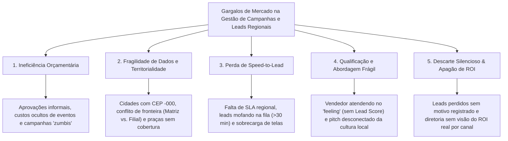
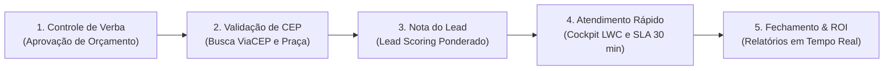
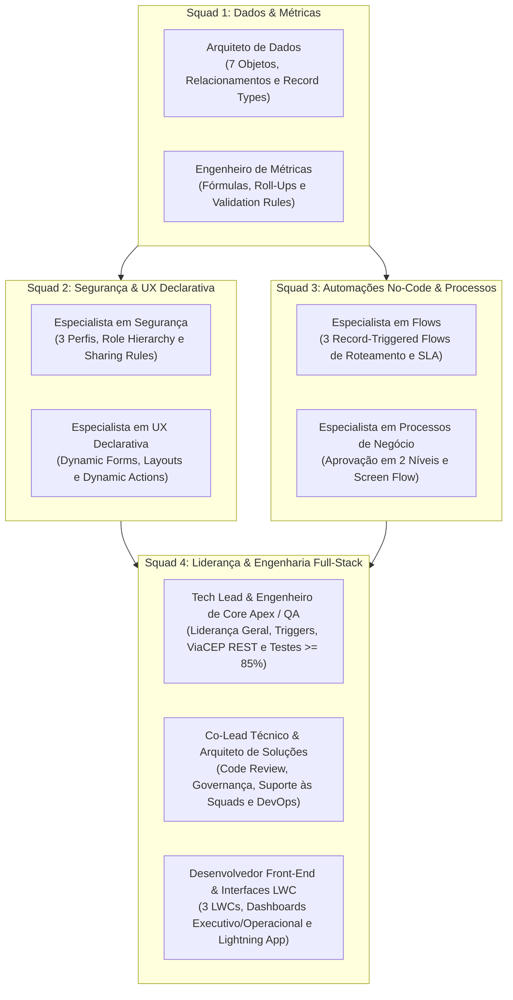

# GeoLead AI — Gestão Inteligente de Campanhas e Leads Regionais

[](https://salesforce.com)
[](https://developer.salesforce.com)
[](https://developer.salesforce.com)
[](https://viacep.com.br)
[](https://geolead-ai.atlassian.net/jira/software/projects/SCRUM/boards/1/backlog)
[](https://www.capgemini.com)

> **Solução Corporativa de Mercado** desenvolvida para o Desafio da Residência em Software & IA (Porto Digital & Capgemini).  
> **Tema 7:** Gestão de Campanhas e Leads Regionais.  
> **Slogan:** *Conectando validação geográfica, governança orçamentária e speed-to-lead para maximizar a conversão de vendas regionais.*

---

## Sumário Executivo

- [1. Diagnóstico de Mercado (Árvore de Problemas)](#1-diagnóstico-de-mercado-árvore-de-problemas)
- [2. A Solução: Plataforma GeoLead AI](#2-a-solução-plataforma-geolead-ai)
- [3. Conformidade com os Requisitos Obrigatórios do Edital](#3-conformidade-com-os-requisitos-obrigatórios-do-edital)
- [4. Organização da Equipe (Squads e Funções)](#4-organização-da-equipe-squads-e-funções)
- [5. Gestão Ágil no Jira & Convenção de Commits](#5-gestão-ágil-no-jira--convenção-de-commits)
- [6. Arquitetura do Repositório (`force-app`)](#6-arquitetura-do-repositório-force-app)
- [7. Como Fazer Deploy e Testar na Org](#7-como-fazer-deploy-e-testar-na-org)

---

## 1. Diagnóstico de Mercado (Árvore de Problemas)

Empresas com operação de vendas distribuída em múltiplas capitais e cidades do interior enfrentam 5 gargalos estruturais no funil de marketing e vendas:



| Eixo de Problema | Subproblemas Operacionais | Impacto no Negócio |
| :--- | :--- | :--- |
| **1. Ineficiência Orçamentária** | • 1.1 Aprovações informais e ausência de alçadas.<br>• 1.2 Ilusão do CPL barato vs. Receita Real.<br>• 1.3 Custos ocultos e campanhas "zumbis" sem prazo. | Estouro de verba; corte equivocado de eventos lucrativos por falta de cálculo de ROI; alocação cega de recursos. |
| **2. Fragilidade Cadastral & Territorial** | • 2.1 Peculiaridades de CEP no Brasil (cidades com CEP `-000`).<br>• 2.2 Conflito de fronteira territorial (Matriz vs. Filial).<br>• 2.3 Leads fora da zona de atendimento logístico. | Disputa interna entre filiais; envio de leads para equipes do estado errado; cliente abordado em duplicidade. |
| **3. Perda de Speed-to-Lead** | • 3.1 Leads represados por ausência de SLA regional.<br>• 3.2 Ausência de escalonamento e transbordo automático.<br>• 3.3 Sobrecarga cognitiva do SDR (múltiplas telas). | Queda de até 60% na probabilidade de conversão após 30 minutos sem contato; lead esfria e busca a concorrência. |
| **4. Qualificação & Abordagem Frágil** | • 4.1 Atendimento no "feeling" sem priorização (falta de Lead Scoring).<br>• 4.2 Ruptura sociocultural no pitch comercial. | SDR atende por ordem de chegada; contatos de alto valor ficam atrás de curiosos; pitch com jargão que afasta clientes do interior. |
| **5. Descarte Silencioso & Apagão de ROI** | • 5.1 Descarte de leads sem feedback para o Marketing.<br>• 5.2 Metas regionais opacas e falta de ROI consolidado. | Marketing segue gastando verba atraindo o perfil errado; diretoria só descobre perda de meta no fim do trimestre. |

---

## 2. A Solução: Plataforma GeoLead AI

O **GeoLead AI** é uma plataforma desenvolvida dentro do Salesforce que resolve os principais gargalos de vendas regionais: **o orçamento de marketing é gasto sem controle formal, os leads chegam com CEP incorreto, demoram para ser atendidos e acabam fechando com a concorrência.**

A solução conecta 5 etapas em um fluxo contínuo e integrado:



### Como Funciona Cada Módulo (Explicado de Forma Simples e Detalhada)

#### 1. Controle de Verba e Governança (Fim das campanhas sem controle)
* **O que resolve:** Impede que equipes gastem verba da empresa em eventos ou anúncios digitais sem autorização formal e sem meta clara de faturamento.
* **Como funciona na prática:**
  * Toda campanha criada no Salesforce (`Campanha_Regional__c`) é classificada pelo seu canal: `Digital`, `Evento` ou `Parceiro` (via *Record Types*).
  * **Aprovação automática em 2 níveis:**
    * Campanhas de até **R$ 15.000** precisam apenas da aprovação do **Coordenador Regional**.
    * Campanhas acima de **R$ 15.000** exigem aprovação adicional do **Diretor Comercial**.
  * Enquanto o processo de aprovação está em andamento, o registro fica bloqueado para edição (*Lock Record*), impedindo alterações indevidas no orçamento.
  * **Trava automática:** Nenhuma campanha pode ser ativada se não tiver uma data final estipulada e uma meta regional atrelada (`Meta_Regional__c`).

#### 2. Validação de CEP e Roteamento Regional (GeoEngine)
* **O que resolve:** Evita que um cliente do Nordeste seja atendido por um vendedor do Sudeste, ou que cadastros com CEP incompleto fiquem abandonados no sistema.
* **Como funciona na prática:**
  * Ao informar o CEP de 8 dígitos na tela do lead (`Interesse_Captado__c`), o Salesforce conecta via internet com a API pública do **ViaCEP** através de código Apex (`ViaCEPCalloutService.cls` com processamento assíncrono via `ViaCEPQueueable.cls`).
  * O sistema preenche automaticamente Rua, Bairro, Cidade e Estado no objeto `Endereco_Integrado__c`.
  * **Tratamento para cidades do interior (Fallback CEP único):** Milhares de municípios do interior possuem apenas um CEP geral (terminado em `-000`). O GeoLead AI reconhece essa situação, preenche Cidade e Estado automaticamente e libera a tela para o preenchimento manual da rua, gravando log de auditoria sem travar a operação.
  * O sistema identifica o estado e vincula o lead diretamente à **Região Comercial** correta (`Regiao_Comercial__c`), transferindo o registro para a fila do time de vendas daquela praça.

#### 3. Nota Automática do Lead (Lead Scoring com explicação)
* **O que resolve:** Acaba com o atendimento aleatório no "feeling", direcionando o tempo do vendedor prioritariamente para os contatos com maior chance de compra.
* **Como funciona na prática:**
  * O sistema calcula uma nota de **0 a 100** para cada contato no objeto `Lead_Score__c`, combinando três pilares:
    1. **Origem do Lead (30%):** Eventos presenciais e parceiros homologados recebem peso superior a cadastros avulsos da web.
    2. **Perfil Cadastral (40%):** Tomadores de decisão (Diretores, Gerentes) pontuam mais alto do que cargos operacionais.
    3. **Taxa Histórica da Região (30%):** Praças que historicamente convertem mais aumentam a nota final do contato.
  * **Explicabilidade da nota:** O vendedor não vê apenas um número frio; o sistema exibe os 3 principais fatores que compuseram a nota (ex: *"Diretor de Compras (+30)"*, *"Região com alta conversão (+20)"*), permitindo que ele entenda o potencial da oportunidade.

#### 4. Atendimento Rápido em até 30 Minutos (Cockpit do Vendedor e Alerta de SLA)
* **O que resolve:** Contatar o lead nos primeiros 30 minutos multiplica a chance de conversão; após esse tempo, o cliente esfria e procura alternativas no mercado.
* **Como funciona na prática:**
  * **Cockpit Regional (LWC `regionalLeadCockpit`):** O vendedor atua em um painel unificado em Lightning Web Components que lista os leads ordenados pela pontuação (Lead Score) com um **semáforo de tempo visual**:
    * **Verde:** Menos de 15 minutos na fila (Dentro da janela ideal de contato).
    * **Amarelo:** Entre 15 e 30 minutos (Alerta de prazo de atendimento prestes a expirar).
    * **Vermelho:** Mais de 30 minutos (SLA estourado, exigindo ação prioritária).
  * **Transbordo Automático por Flow:** Se o lead permanecer mais de 30 minutos sem o primeiro atendimento do vendedor, um fluxo automático (*Record-Triggered Flow*) transfere o contato para a fila de transbordo e envia notificação imediata ao Coordenador de Vendas.
  * **Assistente de Vendas Regional (LWC `aiSalesPitchAssistant`):** Componente que sintetiza a campanha de origem e gera roteiro de abordagem comercial customizado com as características e dores da região do comprador.
  * **Trava Anti-Descarte Silencioso:** Qualquer descarte de oportunidade exige o preenchimento de *Motivo de Perda*, fornecendo dados ao marketing sobre motivos de objeção.

#### 5. Fechamento de Vendas e Cálculo de Lucro Real (Analytics e Dashboards)
* **O que resolve:** Oferece visão em tempo real para a diretoria sobre o retorno financeiro exato de cada centavo gasto em campanhas regionais.
* **Como funciona na prática:**
  * Ao converter uma venda, um registro imutável é criado no objeto `Historico_Conversao__c`, gravando tempo de ciclo, receita gerada e vendedor responsável.
  * Fórmulas nativas e *Roll-Up Summaries* no objeto `Campanha_Regional__c` calculam automaticamente o **ROI Real**: `(Receita Gerada - Orçamento) / Orçamento`.
  * **Dois painéis visuais (Dashboards):**
    * **Dashboard Operacional:** Acompanhamento diário da fila de leads, cumprimento da meta de SLA de 30 minutos e taxa de conversão por vendedor.
    * **Dashboard Executivo:** Visão C-Level comparando retorno financeiro por praça, eficiência por canal de marketing e percentual de atingimento das cotas cadastradas em `Meta_Regional__c`.

---

## 3. Conformidade com os Requisitos Obrigatórios do Edital

O projeto foi rigorosamente desenhado para atender e superar todos os critérios de avaliação da Capgemini:

| Requisito do Edital | Aplicação no GeoLead AI | Artefato Gerado no Salesforce |
| :--- | :--- | :--- |
| **Segurança: Perfis** | Perfis Operacional (SDR), Gestor (Coordenador) e Administrativo (Diretor). | `Perfil_Operacional`, `Perfil_Gestor`, `Perfil_Administrativo` |
| **Segurança: Papéis** | Role Hierarchy estruturada verticalmente: Operador ➔ Coordenador ➔ Diretor. | Árvore de Papéis no Setup da Org |
| **Segurança: Compartilhamento** | Sharing Rules territoriais por `Regiao_Comercial__c` e Permission Sets de auditoria. | Criteria-Based Sharing Rules & `GeoLead_Auditor` PermSet |
| **Dados: Mínimo 5 Objetos** | **7 Objetos Customizados:** `Campanha_Regional__c`, `Interesse_Captado__c`, `Lead_Score__c`, `Regiao_Comercial__c`, `Historico_Conversao__c`, `Meta_Regional__c` e `Endereco_Integrado__c`. | Objetos no schema SFDX sob `force-app/main/default/objects/` |
| **Dados: Relacionamentos** | Master-Detail (Campanha ➔ Interesse e Meta) e Lookups (Região, Endereço, Histórico). | Schema relacional de dados com integridade referencial |
| **Dados: Fórmulas & Roll-Ups** | `Score_Final__c`, `ROI__c`, `Dias_Restantes__c`, soma de leads convertidos e receita gerada. | Roll-Up Summaries e Custom Formula Fields |
| **Dados: Record Types** | Segmentação em 3 tipos de campanha: `Digital`, `Evento` e `Parceiro`. | Record Types no objeto `Campanha_Regional__c` |
| **Automação: Flows** | **3 Record-Triggered Flows** (Roteamento, SLA/Transbordo e Conversão) + **1 Screen Flow** com Subflow de checagem de duplicidade. | Fluxos declarativos sob `force-app/main/default/flows/` |
| **Processo de Aprovação** | Aprovação de Orçamento de Campanha em 2 Níveis com alçadas por valor e bloqueio de edição. | Approval Process configurado no Salesforce |
| **Apex: Trigger Framework** | Padrão arquitetural corporativo com separação de responsabilidades (Handler + Service). | `CampanhaTriggerHandler`, `InteresseCaptadoTriggerHandler` |
| **Apex: Integração ViaCEP** | Callout REST Apex para API ViaCEP, Queueable Apex assíncrono e logs em `Endereco_Integrado__c`. | `ViaCEPCalloutService.cls` e `ViaCEPQueueable.cls` |
| **Apex: Testes Unitários** | Classes de teste unitário com mocks de chamada HTTP (`HttpCalloutMock`) e **cobertura $\ge 85\%$**. | `ViaCEPCalloutServiceTest.cls`, etc. |
| **Interface: Lightning App** | Lightning App personalizada (`GeoLead AI`) com navegação, Dynamic Forms e Dynamic Actions. | `GeoLead_AI.app-meta.xml` e Lightning Record Pages |
| **Interface: 2 a 3 LWCs** | 3 LWCs modernos: `regionalLeadCockpit`, `cepAddressLookup` e `aiSalesPitchAssistant`. | Componentes sob `force-app/main/default/lwc/` |
| **Analytics: Dashboards** | Dashboard Executivo (ROI, Metas, Receita) e Dashboard Operacional (SLA, Fila, Canais). | Dashboards e Relatórios nativos do Salesforce |
| **Construção da Marca** | Identidade visual, proposta de valor, logomarca e posicionamento de mercado estruturados. | Marca **GeoLead AI** documentada no repositório |

---

## 4. Organização da Equipe (Squads e Funções)

Para garantir máxima produtividade sem conflitos de deploy, a equipe está organizada em **4 squads ágeis**:



| Squad | Cargo / Função | Escopo Técnico de Entrega |
| :--- | :--- | :--- |
| **Squad 1: Dados & Métricas** | **Arquiteto de Dados** | 7 Objetos Customizados, Relacionamentos (Master-Detail/Lookup) e Record Types de Campanha. |
| | **Engenheiro de Métricas** | Campos Fórmulas (Score, ROI Real, Dias Restantes), Roll-Up Summaries e Regras de Validação. |
| **Squad 2: Segurança & UX Declarativa** | **Especialista em Segurança** | 3 Perfis de Acesso, Role Hierarchy (Hierarquia de Papéis) e Sharing Rules Territoriais. |
| | **Especialista em UX Declarativa** | Lightning Record Pages, Dynamic Forms e Dynamic Actions contextuais. |
| **Squad 3: Automações No-Code & Processos** | **Especialista em Flows** | 3 Record-Triggered Flows (Roteamento Territorial, SLA/Transbordo e Histórico na Conversão). |
| | **Especialista em Processos de Negócio** | Processo de Aprovação em 2 Níveis de Orçamento e Screen Flow com Subflow de Duplicidade. |
| **Squad 4: Liderança & Engenharia Full-Stack** | **Tech Lead & Core Apex / QA** | Arquitetura Geral, Callout ViaCEP REST, Trigger Framework Corporativo e Testes Unitários ($\ge 85\%$). |
| | **Co-Lead Técnico & Arquiteto de Soluções** | Code Review de PRs, Alinhamento Técnico entre Squads, Homologação e DevOps SFDX. |
| | **Desenvolvedor Front-End & Interfaces LWC** | Construção dos 3 LWCs (Cockpit SLA, Busca CEP e Pitch IA), Dashboards e Lightning App. |

---

## 5. Gestão Ágil no Jira & Convenção de Commits

O projeto é gerenciado ativamente no **Jira Software Cloud**:  
**Painel do Jira:** [geolead-ai.atlassian.net](https://geolead-ai.atlassian.net/jira/software/projects/SCRUM/boards/1/backlog)

### Estrutura de Sprints
* **Sprint 1 — Fundação:** Modelagem dos 7 Objetos, Fórmulas de ROI, Perfis e Role Hierarchy. *(Squad 1 e Segurança)*
* **Sprint 2 — Engenharia:** 3 Record-Triggered Flows, Processo de Aprovação em 2 Níveis, Dynamic Forms, Apex Callout ViaCEP e Triggers. *(Squad 2, Squad 3 e Squad 4)*
* **Sprint 3 — LWC & Analytics:** 3 Componentes LWC, Testes Unitários ($\ge 85\%$), Dashboards Executivo/Operacional e App GeoLead AI. *(Squad 4)*

### Convenção de Smart Commits (Rastreabilidade Git ➔ Jira)
Todos os commits devem referenciar a chave do card correspondente no Jira:

```bash
# Exemplo de feat para o ViaCEP (Card SCRUM-25):
git commit -m "SCRUM-25: feat(viacep) implementacao da classe Apex Callout REST com fallback"

# Exemplo de criação de objetos (Card SCRUM-9):
git commit -m "SCRUM-9: chore(schema) criacao dos 7 objetos customizados e master-detail"

# Exemplo de testes unitários (Card SCRUM-27):
git commit -m "SCRUM-27: test(apex) criacao de HttpCalloutMockFactory com cobertura 92%"
```

---

## 6. Arquitetura do Repositório (`force-app`)

O repositório segue o padrão modular do **Salesforce DX (SFDX)**:

```text
geolead-ai/
├── .forceignore
├── sfdx-project.json
├── README.md                              <-- Documentação Oficial da Solução
└── force-app/main/default/
    ├── applications/
    │   └── GeoLead_AI.app-meta.xml        # Lightning App Personalizada
    ├── classes/
    │   ├── ViaCEPCalloutService.cls       # Serviço de Callout REST para ViaCEP
    │   ├── ViaCEPCalloutServiceTest.cls   # Testes unitários com Mock (> 85%)
    │   ├── ViaCEPQueueable.cls            # Chamada assíncrona para governança
    │   ├── CampanhaTriggerHandler.cls     # Trigger Framework Handler
    │   └── HttpCalloutMockFactory.cls     # Utilitário de Mocks de Teste
    ├── flows/
    │   ├── Roteamento_Territorial.flow-meta.xml
    │   ├── SLA_Transbordo_Lead.flow-meta.xml
    │   ├── Historico_Conversao.flow-meta.xml
    │   └── Cadastro_Lead_Screen_Flow.flow-meta.xml
    ├── lwc/
    │   ├── regionalLeadCockpit/           # Cockpit do SDR com semáforo de SLA
    │   ├── cepAddressLookup/              # Buscador e validador visual de CEP
    │   └── aiSalesPitchAssistant/         # Assistente de abordagem regional
    ├── objects/
    │   ├── Campanha_Regional__c/          # Objeto principal de campanhas
    │   ├── Interesse_Captado__c/          # Leads e oportunidades captadas
    │   ├── Lead_Score__c/                 # Notas e explicabilidade do lead
    │   ├── Regiao_Comercial__c/           # Segmentação geográfica e praças
    │   ├── Historico_Conversao__c/        # Auditoria de fechamento de vendas
    │   ├── Meta_Regional__c/              # Metas financeiras por território
    │   └── Endereco_Integrado__c/         # Endereço normalizado e logs ViaCEP
    ├── permissionsets/
    │   ├── GeoLead_Auditor.permissionset-meta.xml
    │   └── GeoLead_Manager.permissionset-meta.xml
    ├── profiles/
    │   ├── Perfil_Operacional.profile-meta.xml
    │   ├── Perfil_Gestor.profile-meta.xml
    │   └── Perfil_Administrativo.profile-meta.xml
    └── triggers/
        ├── CampanhaTrigger.trigger
        └── InteresseCaptadoTrigger.trigger
```

---

## 7. Como Fazer Deploy e Testar na Org

### 1. Autenticar na Org Salesforce
```bash
sf org login web -a geolead-org
```

### 2. Realizar o Deploy dos Metadados
```bash
sf project deploy start -o geolead-org
```

### 3. Atribuir os Permission Sets
```bash
sf org assign permset -n GeoLead_Manager -o geolead-org
```

### 4. Executar os Testes Unitários com Relatório de Cobertura
```bash
sf apex run test -c -r human -o geolead-org
```

---

*Desenvolvido pela equipe do GeoLead AI para a Residência em Software & IA — Porto Digital & Capgemini (2026).*
