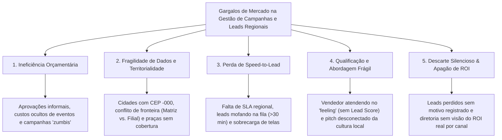
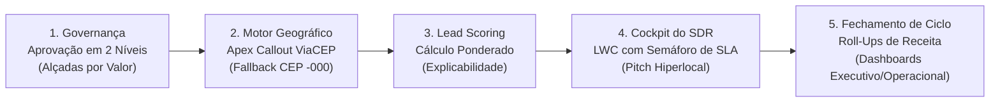
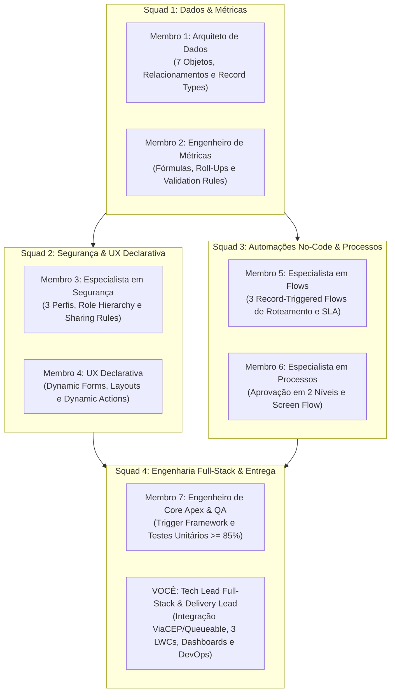

# 📍 GeoLead AI — Gestão Inteligente de Campanhas e Leads Regionais

[](https://salesforce.com)
[](https://developer.salesforce.com)
[](https://developer.salesforce.com)
[](https://viacep.com.br)
[](https://geolead-ai.atlassian.net/jira/software/projects/SCRUM/boards/1/backlog)
[](https://www.capgemini.com)

> **Solução Corporativa de Mercado** desenvolvida para o Desafio da Residência em Software & IA (Porto Digital & Capgemini).  
> **Tema 7:** Gestão de Campanhas e Leads Regionais.  
> **Slogan:** *Conectando validação geográfica, governança orçamentária e speed-to-lead para maximizar a conversão de vendas regionais.*

---

## 📑 Sumário Executivo

- [1. Diagnóstico de Mercado (Árvore de Problemas)](#1-diagnóstico-de-mercado-árvore-de-problemas)
- [2. A Solução: Plataforma GeoLead AI](#2-a-solução-plataforma-geolead-ai)
- [3. Conformidade com os Requisitos Obrigatórios do Edital](#3-conformidade-com-os-requisitos-obrigatórios-do-edital)
- [4. Organização da Equipe (8 Membros em 4 Squads)](#4-organização-da-equipe-8-membros-em-4-squads)
- [5. Gestão Ágil no Jira & Convenção de Commits](#5-gestão-ágil-no-jira--convenção-de-commits)
- [6. Arquitetura do Repositório (`force-app`)](#6-arquitetura-do-repositório-force-app)
- [7. Como Fazer Deploy e Testar na Org](#7-como-fazer-deploy-e-testar-na-org)

---

## 1. Diagnóstico de Mercado (Árvore de Problemas)

Empresas com operação de vendas distribuída em múltiplas capitais e cidades do interior enfrentam 5 gargalos estruturais no funil de marketing e vendas:



| Eixo de Problema | Subproblemas Operacionais | Impacto no Negócio |
| :--- | :--- | :--- |
| **1. Ineficiência Orçamentária** | • 1.1 Aprovações informais e ausência de alçadas.<br>• 1.2 Ilusão do CPL barato vs. Receita Real.<br>• 1.3 Custos ocultos e campanhas "zumbis" sem prazo. | Estouro de verba; corte equivocado de eventos lucrativos por falta de cálculo de ROI; alocação cega de recursos. |
| **2. Fragilidade Cadastral & Territorial** | • 2.1 Peculiaridades de CEP no Brasil (cidades com CEP `-000`).<br>• 2.2 Conflito de fronteira territorial (Matriz vs. Filial).<br>• 2.3 Leads fora da zona de atendimento logístico. | Disputa interna entre filiais; envio de leads para equipes do estado errado; cliente abordado em duplicidade. |
| **3. Perda de Speed-to-Lead** | • 3.1 Leads represados por ausência de SLA regional.<br>• 3.2 Ausência de escalonamento e transbordo automático.<br>• 3.3 Sobrecarga cognitiva do SDR (múltiplas telas). | Queda de até 60% na probabilidade de conversão após 30 minutos sem contato; lead esfria e busca a concorrência. |
| **4. Qualificação & Abordagem Frágil** | • 4.1 Atendimento no "feeling" sem priorização (falta de Lead Scoring).<br>• 4.2 Ruptura sociocultural no pitch comercial. | SDR atende por ordem de chegada; contatos de alto valor ficam atrás de curiosos; pitch com jargão que afasta clientes do interior. |
| **5. Descarte Silencioso & Apagão de ROI** | • 5.1 Descarte de leads sem feedback para o Marketing.<br>• 5.2 Metas regionais opacas e falta de ROI consolidado. | Marketing segue gastando verba atraindo o perfil errado; diretoria só descobre perda de meta no fim do trimestre. |

---

## 2. A Solução: Plataforma GeoLead AI

O **GeoLead AI** unifica a governança de marketing, automação de dados geográficos e produtividade do vendedor em **5 módulos integrados**:



### Detalhamento dos 5 Módulos

1. **Módulo 1: Governança de Campanhas & Controle de Verba**
   * **Record Types de Campanha:** Segmentação entre `Digital`, `Evento` e `Parceiro`, com campos específicos para cada canal.
   * **Processo de Aprovação em 2 Níveis:**
     * *Alçada 1 (até R$ 15.000):* Aprovação pelo **Coordenador/Gestor Regional**.
     * *Alçada 2 (acima de R$ 15.000):* Escalonamento obrigatório para validação final do **Diretor Comercial**.
   * **Travas Anti-Campanha Zumbi:** Bloqueio de ativação sem prazo final definido e meta regional atrelada.

2. **Módulo 2: Motor Geográfico & Territorial (GeoEngine)**
   * **Apex Callout REST ViaCEP:** Ao digitar o CEP de 8 dígitos, o sistema consulta a API pública e popula instantaneamente o objeto `Endereco_Integrado__c`.
   * **Fallback Resiliente para o Interior:** Para cidades com CEP único municipal (terminado em `-000`), o sistema preenche Cidade e Estado e desbloqueia o preenchimento manual guiado, gravando log de auditoria.
   * **Roteamento "Operação > Sede":** Resolução de conflitos Matriz vs. Filial priorizando o endereço de entrega para associar automaticamente à `Regiao_Comercial__c` correta.

3. **Módulo 3: Motor de Lead Scoring Preditivo & Explicável**
   * **Cálculo Multidimensional (0 a 100 pontos):** Ponderação entre Canal de Origem (30%), Perfil Cadastral/Cargo (40%) e Taxa Histórica Regional (30%).
   * **Explicabilidade da Nota:** O objeto `Lead_Score__c` armazena não apenas o número, mas os 3 principais fatores positivos e de risco para o vendedor entender o motivo da nota.

4. **Módulo 4: Cockpit do SDR & Speed-to-Lead**
   * **LWC `regionalLeadCockpit`:** Painel unificado tipo "mesa de operações" com semáforo visual de SLA (🟢 <15m, 🟡 <45m, 🔴 >45m) e ordenação por pontuação.
   * **Automação de Transbordo por Flow:** Se um lead passar mais de 30 minutos sem atendimento, o Flow notifica o Coordenador e transfere o registro para o operador de plantão.
   * **LWC `aiSalesPitchAssistant`:** Gera argumentos e roteiro de abordagem comercial contextualizados com as características socioeconômicas da praça regional do lead.
   * **Anti-Descarte Silencioso:** Validação obrigatória de *Motivo de Perda* para fechar o loop de feedback com o time de marketing.

5. **Módulo 5: Analytics de Fechamento de Ciclo & Metas**
   * **Fórmulas e Roll-Up Summaries:** Cálculo automático em tempo real de **ROI Real** `[(Receita - Orçamento) / Orçamento]`, Leads Convertidos e Faturamento Acumulado.
   * **Dashboard Operacional:** Acompanhamento diário da fila de leads, cumprimento de SLA e conversão por canal.
   * **Dashboard Executivo:** Visão C-Level de faturamento por região, comparativo CPL vs. CAC e atingimento das cotas em `Meta_Regional__c`.

---

## 3. Conformidade com os Requisitos Obrigatórios do Edital

O projeto foi rigorosamente desenhado para atender e superar todos os critérios de avaliação da Capgemini:

| Requisito do Edital | Aplicação no GeoLead AI | Artefato Gerado no Salesforce |
| :--- | :--- | :--- |
| **Segurança: Perfis** | Perfis Operacional (SDR), Gestor (Coordenador) e Administrativo (Diretor). | `Perfil_Operacional`, `Perfil_Gestor`, `Perfil_Administrativo` |
| **Segurança: Papéis** | Role Hierarchy estruturada verticalmente: Operador ➔ Coordenador ➔ Diretor. | Árvore de Papéis no Setup da Org |
| **Segurança: Compartilhamento** | Sharing Rules territoriais por `Regiao_Comercial__c` e Permission Sets de auditoria. | Criteria-Based Sharing Rules & `GeoLead_Auditor` PermSet |
| **Dados: Mínimo 5 Objetos** | **7 Objetos Customizados:** `Campanha_Regional__c`, `Interesse_Captado__c`, `Lead_Score__c`, `Regiao_Comercial__c`, `Historico_Conversao__c`, `Meta_Regional__c` e `Endereco_Integrado__c`. | Objetos no schema SFDX sob `force-app/main/default/objects/` |
| **Dados: Relacionamentos** | Master-Detail (Campanha ➔ Interesse e Meta) e Lookups (Região, Endereço, Histórico). | Schema relacional de dados com integridade referencial |
| **Dados: Fórmulas & Roll-Ups** | `Score_Final__c`, `ROI__c`, `Dias_Restantes__c`, soma de leads convertidos e receita gerada. | Roll-Up Summaries e Custom Formula Fields |
| **Dados: Record Types** | Segmentação em 3 tipos de campanha: `Digital`, `Evento` e `Parceiro`. | Record Types no objeto `Campanha_Regional__c` |
| **Automação: Flows** | **3 Record-Triggered Flows** (Roteamento, SLA/Transbordo e Conversão) + **1 Screen Flow** com Subflow de checagem de duplicidade. | Fluxos declarativos sob `force-app/main/default/flows/` |
| **Processo de Aprovação** | Aprovação de Orçamento de Campanha em 2 Níveis com alçadas por valor e bloqueio de edição. | Approval Process configurado no Salesforce |
| **Apex: Trigger Framework** | Padrão arquitetural corporativo com separação de responsabilidades (Handler + Service). | `CampanhaTriggerHandler`, `InteresseCaptadoTriggerHandler` |
| **Apex: Integração ViaCEP** | Callout REST Apex para API ViaCEP, Queueable Apex assíncrono e logs em `Endereco_Integrado__c`. | `ViaCEPCalloutService.cls` e `ViaCEPQueueable.cls` |
| **Apex: Testes Unitários** | Classes de teste unitário com mocks de chamada HTTP (`HttpCalloutMock`) e **cobertura $\ge 85\%$**. | `ViaCEPCalloutServiceTest.cls`, etc. |
| **Interface: Lightning App** | Lightning App personalizada (`GeoLead AI`) com navegação, Dynamic Forms e Dynamic Actions. | `GeoLead_AI.app-meta.xml` e Lightning Record Pages |
| **Interface: 2 a 3 LWCs** | 3 LWCs modernos: `regionalLeadCockpit`, `cepAddressLookup` e `aiSalesPitchAssistant`. | Componentes sob `force-app/main/default/lwc/` |
| **Analytics: Dashboards** | Dashboard Executivo (ROI, Metas, Receita) e Dashboard Operacional (SLA, Fila, Canais). | Dashboards e Relatórios nativos do Salesforce |
| **Construção da Marca** | Identidade visual, proposta de valor, logomarca e posicionamento de mercado estruturados. | Marca **GeoLead AI** documentada no repositório |

---

## 4. Organização da Equipe (8 Membros em 4 Squads)

Para garantir máxima produtividade sem conflitos de deploy, a equipe está organizada em **4 duplas ágeis**:



---

## 5. Gestão Ágil no Jira & Convenção de Commits

O projeto é gerenciado ativamente no **Jira Software Cloud**:  
🔗 **Painel do Jira:** [geolead-ai.atlassian.net](https://geolead-ai.atlassian.net/jira/software/projects/SCRUM/boards/1/backlog)

### Estrutura de Sprints
* 📦 **Sprint 1 — Fundação:** Modelagem dos 7 Objetos, Fórmulas de ROI, Perfis e Role Hierarchy. *(Membros 1, 2 e 3)*
* 📦 **Sprint 2 — Engenharia:** 3 Record-Triggered Flows, Processo de Aprovação em 2 Níveis, Dynamic Forms, Apex Callout ViaCEP e Triggers. *(Membros 4, 5, 6, 7 e Você)*
* 📦 **Sprint 3 — LWC & Analytics:** 3 Componentes LWC, Testes Unitários ($\ge 85\%$), Dashboards Executivo/Operacional e App GeoLead AI. *(Você e Membro 7)*

### Convenção de Smart Commits (Rastreabilidade Git ➔ Jira)
Todos os commits devem referenciar a chave do card correspondente no Jira:

```bash
# Exemplo de feat para o ViaCEP (Card SCRUM-25):
git commit -m "SCRUM-25: feat(viacep) implementacao da classe Apex Callout REST com fallback"

# Exemplo de criação de objetos (Card SCRUM-9):
git commit -m "SCRUM-9: chore(schema) criacao dos 7 objetos customizados e master-detail"

# Exemplo de testes unitários (Card SCRUM-27):
git commit -m "SCRUM-27: test(apex) criacao de HttpCalloutMockFactory com cobertura 92%"
```

---

## 6. Arquitetura do Repositório (`force-app`)

O repositório segue o padrão modular do **Salesforce DX (SFDX)**:

```text
agitated-babbage/
├── .forceignore
├── sfdx-project.json
├── README.md                              <-- Documentação Oficial da Solução
├── PLANEJAMENTO_PROJETO_CAPGEMINI.pdf     <-- Planejamento Executivo (2 páginas)
├── jira_backlog_geolead.csv               <-- Backlog Completo de Importação do Jira
└── force-app/main/default/
    ├── applications/
    │   └── GeoLead_AI.app-meta.xml        # Lightning App Personalizada
    ├── classes/
    │   ├── ViaCEPCalloutService.cls       # Serviço de Callout REST para ViaCEP
    │   ├── ViaCEPCalloutServiceTest.cls   # Testes unitários com Mock (> 85%)
    │   ├── ViaCEPQueueable.cls            # Chamada assíncrona para governança
    │   ├── CampanhaTriggerHandler.cls     # Trigger Framework Handler
    │   └── HttpCalloutMockFactory.cls     # Utilitário de Mocks de Teste
    ├── flows/
    │   ├── Roteamento_Territorial.flow-meta.xml
    │   ├── SLA_Transbordo_Lead.flow-meta.xml
    │   ├── Historico_Conversao.flow-meta.xml
    │   └── Cadastro_Lead_Screen_Flow.flow-meta.xml
    ├── lwc/
    │   ├── regionalLeadCockpit/           # Cockpit do SDR com semáforo de SLA
    │   ├── cepAddressLookup/              # Buscador e validador visual de CEP
    │   └── aiSalesPitchAssistant/         # Assistente de abordagem regional
    ├── objects/
    │   ├── Campanha_Regional__c/          # Objeto principal de campanhas
    │   ├── Interesse_Captado__c/          # Leads e oportunidades captadas
    │   ├── Lead_Score__c/                 # Notas e explicabilidade do lead
    │   ├── Regiao_Comercial__c/           # Segmentação geográfica e praças
    │   ├── Historico_Conversao__c/        # Auditoria de fechamento de vendas
    │   ├── Meta_Regional__c/              # Metas financeiras por território
    │   └── Endereco_Integrado__c/         # Endereço normalizado e logs ViaCEP
    ├── permissionsets/
    │   ├── GeoLead_Auditor.permissionset-meta.xml
    │   └── GeoLead_Manager.permissionset-meta.xml
    ├── profiles/
    │   ├── Perfil_Operacional.profile-meta.xml
    │   ├── Perfil_Gestor.profile-meta.xml
    │   └── Perfil_Administrativo.profile-meta.xml
    └── triggers/
        ├── CampanhaTrigger.trigger
        └── InteresseCaptadoTrigger.trigger
```

---

## 7. Como Fazer Deploy e Testar na Org

### 1. Autenticar na Org Salesforce
```bash
sf org login web -a geolead-org
```

### 2. Realizar o Deploy dos Metadados
```bash
sf project deploy start -o geolead-org
```

### 3. Atribuir os Permission Sets
```bash
sf org assign permset -n GeoLead_Manager -o geolead-org
```

### 4. Executar os Testes Unitários com Relatório de Cobertura
```bash
sf apex run test -c -r human -o geolead-org
```

---

*Desenvolvido pela equipe do GeoLead AI para a Residência em Software & IA — Porto Digital & Capgemini (2026).*
